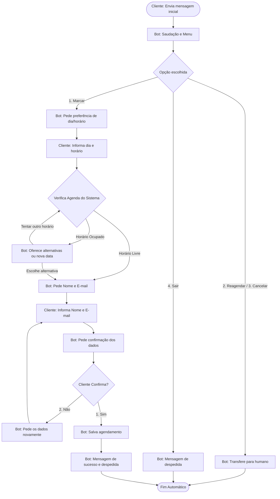

# Fluxo do Bot de WhatsApp

Este documento descreve passo a passo o fluxo de conversa do bot de WhatsApp.

## 1. Saudação e Menu Principal

**Gatilho:** O cliente envia a primeira mensagem (ex: "Olá", "Bom dia", etc.) ou inicia a conversa.

**Ação do Bot:**
- Agradece o recebimento da mensagem.
- Apresenta as opções de atendimento de forma clara.

**Exemplo de Mensagem do Bot:**
> "Olá! Obrigado por entrar em contato conosco. 🤖\n> \n> Como posso te ajudar hoje? Por favor, digite o número da opção desejada:\n> \n> 1️⃣ - Marcar consulta\n> 2️⃣ - Reagendar\n> 3️⃣ - Cancelar\n> 4️⃣ - Sair da conversa"

---

## 2. Direcionamento das Opções (Menu Principal)

A depender da opção escolhida pelo cliente no passo 1, o bot tomará as seguintes ações:

### Opção 1: Marcar consulta
**Ação do Bot:** Solicita que o cliente informe a preferência de dia e horário.
**Exemplo de Mensagem do Bot:**
> "Perfeito! Para agendarmos sua consulta, por favor, me informe qual o melhor **dia e horário** para você."

### Opção 2 e 3: Reagendar ou Cancelar
**Ação do Bot:** Informa que a solicitação foi repassada para a equipe e que um atendente humano irá dar continuidade.
**Exemplo de Mensagem do Bot:**
> "Entendido! Um de nossos atendentes humanos já foi notificado e dará continuidade ao seu atendimento em instantes para realizar essa alteração. Aguarde um momento! 👤"
*(Fim do fluxo automatizado do bot)*

### Opção 4: Sair da conversa
**Ação do Bot:** Despede-se e encerra o fluxo.
**Exemplo de Mensagem do Bot:**
> "Tudo bem! Se precisar de algo no futuro, estaremos por aqui. Tenha um ótimo dia! 👋"
*(Fim do fluxo automatizado do bot)*

---

## 3. Verificação de Agenda e Coleta de Dados

**Gatilho:** Cliente informa a preferência de dia e horário em resposta à Opção 1.

**Ação do Bot (Interna):** Verifica com o sistema a disponibilidade da agenda para a data e hora solicitadas.

### 3.1. Cenário: Horário Disponível
**Ação do Bot:** Confirma a disponibilidade e solicita os dados pessoais do cliente.
**Exemplo de Mensagem do Bot:**
> "Maravilha! Temos esse horário livre sim. 📅
> 
> Para finalizarmos a sua reserva, por favor, me informe o seu **Nome Completo** e o seu **E-mail**."

### 3.2. Cenário: Horário Indisponível
**Ação do Bot:** Informa a indisponibilidade, apresenta outras opções de horários próximos e permite que o cliente escolha uma das sugestões ou digite um novo horário.
**Exemplo de Mensagem do Bot:**
> "Puxa, infelizmente esse horário já está ocupado. 😕
> 
> Mas encontrei essas alternativas próximas disponíveis:
> 1️⃣ - [Sugerir Horário A]
> 2️⃣ - [Sugerir Horário B]
> 3️⃣ - Quero tentar outro dia/horário diferente
> 
> Como você prefere seguir? (Digite 1, 2 ou 3)"

**Ação de Continuação:** 
- Se o cliente escolher **1** ou **2**, o horário é marcado como "Disponível" e o fluxo avança para o Cenário 3.1 (pedindo Nome e E-mail).
- Se o cliente escolher **3** ou escrever outro horário diretamente, o bot volta ao início do Passo 3 e verifica a nova data/hora (ficando em loop até encontrar um horário livre).

---

## 4. Confirmação de Dados e Agendamento

**Gatilho:** Cliente responde com seu nome e e-mail.

**Ação do Bot:** Exibe os dados que o cliente acabou de informar e pede uma confirmação final.

**Exemplo de Mensagem do Bot:**
> "Quase lá! Para não termos nenhum erro, por favor, confira os dados fornecidos:
> 
> 👤 **Nome:** [Nome digitado pelo cliente]
> 📧 **E-mail:** [E-mail digitado pelo cliente]
> 
> Está tudo certo?
> 1️⃣ - Sim, pode confirmar!
> 2️⃣ - Não, quero corrigir os dados."

### 4.1. Se o cliente Confirmar (Opção 1)
**Ação do Bot:** Efetiva o agendamento no sistema e envia a mensagem final de agradecimento.
**Exemplo de Mensagem do Bot:**
> "Tudo certo! Sua consulta foi agendada com sucesso. ✅📋
> Agradecemos muito a preferência e nos vemos em breve!"
*(Fim do fluxo automatizado do bot)*

### 4.2. Se o cliente Não Confirmar (Opção 2)
**Ação do Bot:** Volta a pedir os dados.
**Exemplo de Mensagem do Bot:**
> "Sem problemas! Vamos tentar de novo.
> Por favor, digite novamente o seu **Nome Completo** e o seu **E-mail**."
*(O bot volta para o início do Passo 4 para confirmar os novos dados)*

---

## 5. Diagrama de Fluxo Visual

Abaixo segue a representação visual (em formato Mermaid) de todo o fluxo descrito:

